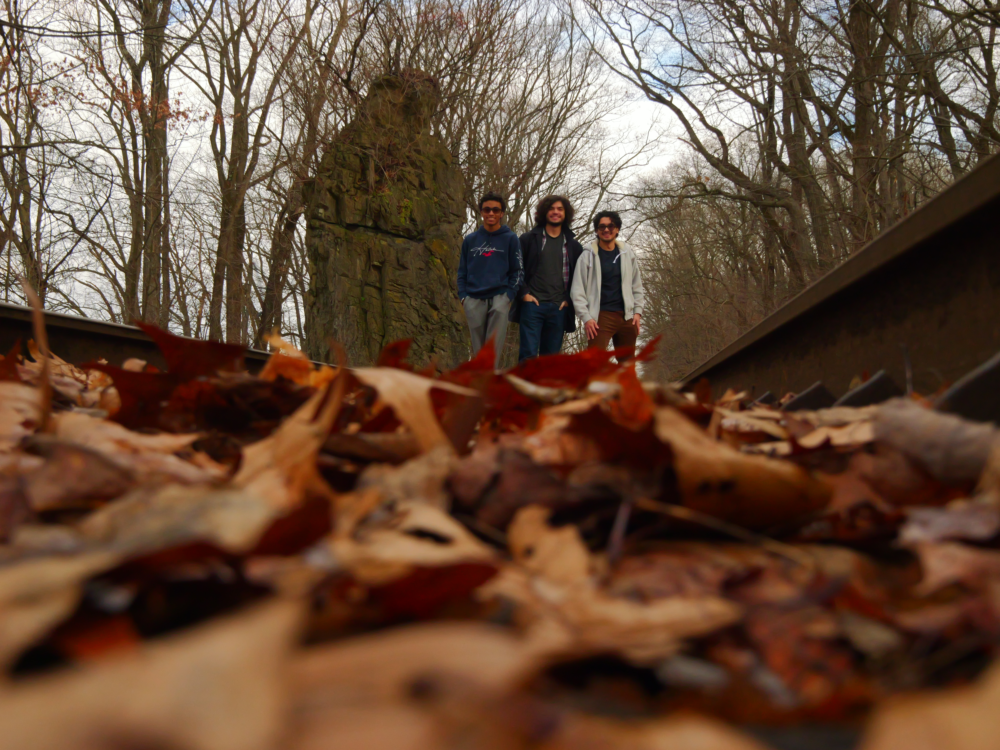

{width="586"}

I am a senior undergraduate pursuing a B.S. in Biochemistry and a first year combined masters student in biotechnology on the pharmacology track at Case Western Reserve University. I am currently working at Arvidson lab on ketone metabolics of cockroach neurons.

To connect with me professionally visit [www.linkedin.com/in/clemente-brogca-4b6191303](www.linkedin.com/in/clemente-brogca-4b6191303)

or contact through the email cab348\@case.edu
